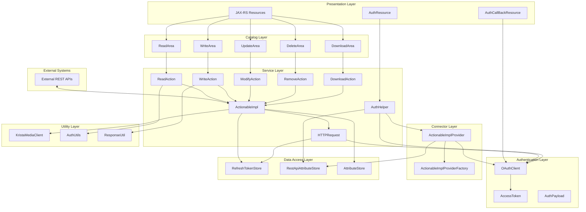
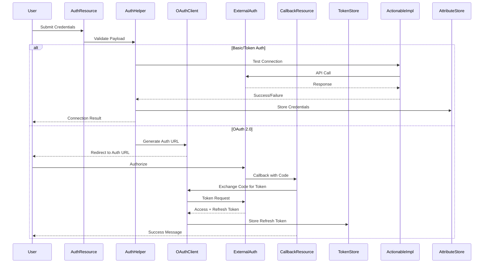
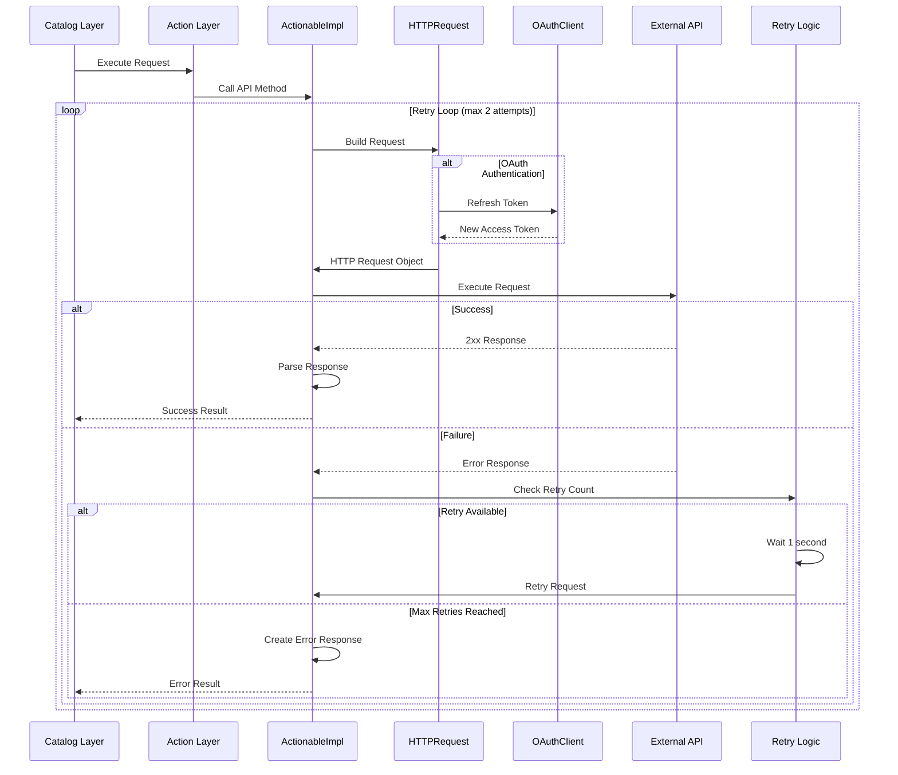

# REST API Extension - Architecture Documentation

## Table of Contents
1. [Overview](#overview)
2. [Architecture Layers](#architecture-layers)
3. [Component Diagrams](#component-diagrams)
4. [Authentication Flow](#authentication-flow)
5. [Request Processing Flow](#request-processing-flow)
6. [Performance Limitations](#performance-limitations)
7. [Error Scenarios](#error-scenarios)
8. [Data Flow](#data-flow)

---

## Overview

The REST API Extension is a comprehensive integration solution designed to bridge Krista environments with external applications through RESTful APIs. It provides enterprise-grade security, multiple authentication mechanisms, and robust error handling.

**Version:** 2.0.16 
**Java Version:** Java 21  
**JAX-RS ID:** rest

### Key Capabilities
- Universal REST API connectivity (GET, POST, PUT, PATCH, DELETE)
- Multiple authentication types (Basic, Token, OAuth 2.0)
- File upload/download support
- Pagination support
- Event-driven asynchronous processing
- Retry mechanism with exponential backoff
- Custom header and query parameter support

---

## Architecture Layers

The REST API Extension follows a layered architecture pattern with clear separation of concerns:

### 1. **Presentation Layer** (JAX-RS Resources)
- **Location:** `app.krista.extensions.development.api.rest.api`
- **Components:**
  - `RestApiApplication` - JAX-RS application configuration
  - `AuthResource` - Authentication endpoint handler
  - `AuthCallBackResource` - OAuth callback handler

**Responsibilities:**
- HTTP request/response handling
- Route mapping
- Input validation
- Response formatting

### 2. **Catalog Layer** (Domain Operations)
- **Location:** `app.krista.extensions.development.api.rest.catalog`
- **Components:**
  - `ReadArea` - GET operations
  - `WriteArea` - POST operations
  - `UpdateArea` - PUT/PATCH operations
  - `DeleteArea` - DELETE operations
  - `DownloadArea` - File download operations

**Responsibilities:**
- Domain-specific request handling
- Catalog request annotations
- Event handling for async operations
- Response transformation

### 3. **Service Layer** (Business Logic)
- **Location:** `app.krista.extensions.development.api.rest.impl`
- **Components:**
  - `ActionableImpl` - Core HTTP client implementation
  - `HTTPRequest` - Request builder
  - `ReadAction` - Read operation logic
  - `WriteAction` - Write operation logic
  - `ModifyAction` - Update operation logic
  - `RemoveAction` - Delete operation logic
  - `DownloadAction` - Download operation logic
  - `AuthHelper` - Authentication helper

**Responsibilities:**
- Business logic execution
- HTTP request construction
- Response parsing
- Retry logic
- Error handling

### 4. **Authentication Layer**
- **Location:** `app.krista.extensions.development.api.rest.auth`
- **Components:**
  - `OAuthClient` - OAuth 2.0 client
  - `AccessToken` - Token model
  - `AuthPayload` - Authentication payload
  - `AttributeStore` - Credential storage

**Responsibilities:**
- Authentication flow management
- Token refresh
- Credential validation
- OAuth URL generation

### 5. **Connector Layer**
- **Location:** `app.krista.extensions.development.api.rest.connectors`
- **Components:**
  - `ActionableImplProvider` - Client provider
  - `ActionableImplProviderFactory` - Factory for client creation

**Responsibilities:**
- Client instantiation
- Dependency injection
- Context management

### 6. **Data Access Layer** (Stores)
- **Location:** `app.krista.extensions.development.api.rest.stores`
- **Components:**
  - `RefreshTokenStore` - Token persistence
  - `RestApiAttributeStore` - Credential persistence
  - `AttributeStore` - Generic attribute storage

**Responsibilities:**
- Data persistence
- Key-value storage operations
- Credential lifecycle management

### 7. **Utility Layer**
- **Location:** `app.krista.extensions.development.api.rest.util`
- **Components:**
  - `KristaMediaClient` - File handling
  - `AuthUtils` - Authentication utilities
  - `ResponseUtil` - Response formatting
  - `RestApiConstants` - Constants

**Responsibilities:**
- Cross-cutting concerns
- File conversion
- Utility functions
- Constants management

---

## Component Diagrams

### High-Level Architecture



### Authentication Flow Diagram



### Request Processing Flow



---

## Authentication Flow

### Supported Authentication Types

1. **Basic Authentication**
   - Username and password
   - Base64 encoded in Authorization header
   - Stored in AttributeStore

2. **Token Authentication**
   - Bearer token or custom token type
   - Added to Authorization header
   - Supports custom token types

3. **OAuth 2.0**
   - Authorization Code flow
   - Automatic token refresh
   - Refresh token persistence
   - Supports custom scopes

### OAuth 2.0 Flow Details

```
1. User initiates authentication
2. System generates OAuth URL with:
   - client_id
   - redirect_uri (callback endpoint)
   - scope
   - state (user identifier)
   - access_type=offline
   - approval_prompt=force
3. User redirected to authorization server
4. User grants permission
5. Authorization server redirects to callback with code
6. System exchanges code for tokens
7. Refresh token stored in RefreshTokenStore
8. Access token used for API calls
9. Token automatically refreshed when expired
```

### Token Refresh Mechanism

- Automatic refresh on 401 Unauthorized responses
- Refresh token stored per user
- Fallback to refresh token if access token refresh fails
- Token revocation support for Google OAuth

---

## Performance Limitations

### 1. **Concurrency Limitations**
- **Single Thread Executor for Events:** Each catalog area (Read, Write) uses `Executors.newSingleThreadExecutor()`
- **Impact:** Only one async event can be processed at a time per area
- **Recommendation:** Consider using thread pools for high-volume scenarios

### 2. **Retry Mechanism**
- **Max Retries:** 2 attempts
- **Retry Delay:** 1 second (fixed)
- **Impact:** Total request time can be up to 3x normal (initial + 2 retries)
- **Recommendation:** Implement exponential backoff for production use

### 3. **File Handling**
- **Temporary Storage:** Files stored in `/tmp/` directory
- **Unsupported Formats:** Automatically zipped (html, php5, pht, phtml, shtml, asa, cer, asax, swf, xap, jsp, exe, js)
- **Buffer Size:** 4KB for file operations
- **Impact:** Large files may cause memory pressure
- **Recommendation:** Stream large files instead of loading into memory

### 4. **HTTP Client**
- **Client Creation:** New OkHttpClient created per request
- **Impact:** No connection pooling, higher latency
- **Recommendation:** Use singleton OkHttpClient with connection pool

### 5. **Pagination**
- **In-Memory Processing:** Entire response loaded before pagination
- **Impact:** Large datasets may cause OutOfMemoryError
- **Recommendation:** Implement streaming pagination

### 6. **Token Storage**
- **KeyValueStore:** In-memory or database-backed (implementation dependent)
- **Impact:** Token loss on restart if in-memory
- **Recommendation:** Ensure persistent storage configuration

### 7. **Response Size**
- **No Size Limits:** Responses fully loaded into memory
- **Impact:** Large responses can cause memory issues
- **Recommendation:** Implement response size limits

---

## Error Scenarios

### 1. **Authentication Errors**

#### Scenario: Invalid Credentials
- **Trigger:** Wrong username/password or invalid token
- **Error Type:** `MustAuthorizeException`
- **Response:** Test connection fails with error message
- **Recovery:** User must provide valid credentials

#### Scenario: OAuth Token Expired
- **Trigger:** Refresh token expired or revoked
- **Error Type:** `MustAuthorizeException`
- **Response:** "Refresh Token Expired. Please reauthorize yourself"
- **Recovery:** User must re-authenticate via OAuth flow

#### Scenario: Missing Authorization
- **Trigger:** No credentials stored
- **Error Type:** `MustAuthorizeException`
- **Response:** "You are not authorized. Please authorize."
- **Recovery:** User must authenticate

### 2. **Network Errors**

#### Scenario: Connection Timeout
- **Trigger:** API endpoint unreachable
- **Error Type:** `ConnectException`
- **Response:** "Error connecting to API endpoint: {url}"
- **Recovery:** Automatic retry (up to 2 times)

#### Scenario: Request Timeout
- **Trigger:** API response takes too long
- **Error Type:** `SocketTimeoutException`
- **Response:** "Request timed out for API endpoint: {url}"
- **Recovery:** Automatic retry (up to 2 times)

#### Scenario: Network Interruption
- **Trigger:** Network failure during request
- **Error Type:** `IOException`
- **Response:** Error message with details
- **Recovery:** Automatic retry (up to 2 times)

### 3. **API Errors**

#### Scenario: 4xx Client Errors
- **Trigger:** Bad request, unauthorized, not found, etc.
- **Response:** Status code and message in response info
- **Recovery:** No automatic retry, user must fix request

#### Scenario: 5xx Server Errors
- **Trigger:** Internal server error, service unavailable
- **Response:** Status code and message in response info
- **Recovery:** Automatic retry (up to 2 times)

### 4. **Data Processing Errors**

#### Scenario: Invalid JSON Response
- **Trigger:** API returns malformed JSON
- **Error Type:** `JsonSyntaxException`
- **Response:** Error message with parsing details
- **Recovery:** No automatic recovery

#### Scenario: File Conversion Error
- **Trigger:** Unable to convert file format
- **Error Type:** `IOException`
- **Response:** Error message with file details
- **Recovery:** File automatically zipped if unsupported format

### 5. **Configuration Errors**

#### Scenario: Invalid Auth Type
- **Trigger:** Unsupported authentication type
- **Error Type:** `IllegalArgumentException`
- **Response:** "Invalid auth type"
- **Recovery:** User must select valid auth type

#### Scenario: Missing Required Fields
- **Trigger:** Required authentication fields not provided
- **Response:** "Provide valid input"
- **Recovery:** User must provide all required fields

### Error Response Format

All errors return a standardized format:
```json
{
  "Response Info": {
    "Status and Message": "Error Message: {message}\nError Type: {type}\nDetails: {details}"
  },
  "Response": null
}
```

---

## Data Flow

### Request Data Flow

```
User Input
    ↓
Catalog Layer (Validation)
    ↓
Action Layer (Business Logic)
    ↓
ActionableImpl (HTTP Client)
    ↓
HTTPRequest (Request Building)
    ↓
Authentication Layer (Token/Credentials)
    ↓
OkHttpClient (HTTP Execution)
    ↓
External API
```

### Response Data Flow

```
External API
    ↓
OkHttpClient (Raw Response)
    ↓
ActionableImpl (Response Parsing)
    ↓
Response Transformation (JSON/File)
    ↓
Action Layer (Response Wrapping)
    ↓
Catalog Layer (FreeForm Conversion)
    ↓
User Output
```

### Credential Storage Flow

```
User Credentials
    ↓
AuthPayload (Validation)
    ↓
RestApiAttributes (Model)
    ↓
RestApiAttributeStore (Serialization)
    ↓
KeyValueStore (Persistence)
```

### Token Management Flow

```
OAuth Authorization
    ↓
Authorization Code
    ↓
OAuthClient (Token Exchange)
    ↓
AccessToken + RefreshToken
    ↓
RefreshTokenStore (Persistence)
    ↓
HTTPRequest (Token Usage)
    ↓
Token Refresh (if expired)
    ↓
Updated Token Storage
```

---

## Best Practices

### For Developers

1. **Always handle MustAuthorizeException** - Prompt users to authenticate
2. **Use appropriate retry strategies** - Consider exponential backoff
3. **Validate input before API calls** - Reduce unnecessary network calls
4. **Monitor token expiration** - Implement proactive refresh
5. **Log all API interactions** - Use SLF4J logger for debugging
6. **Handle large responses carefully** - Consider streaming for large datasets
7. **Clean up resources** - Always close response bodies

### For Users

1. **Test connections after authentication** - Verify credentials work
2. **Monitor API rate limits** - External APIs may have quotas
3. **Use appropriate authentication type** - OAuth for long-lived integrations
4. **Handle async operations** - Use event-based patterns for long requests
5. **Validate API URLs** - Ensure correct endpoints before execution

---

## Future Enhancements

1. **Connection Pooling** - Reuse HTTP connections for better performance
2. **Circuit Breaker Pattern** - Prevent cascading failures
3. **Rate Limiting** - Protect against API quota exhaustion
4. **Metrics Collection** - Monitor performance and errors
5. **Streaming Support** - Handle large responses efficiently
6. **Configurable Retry Policy** - Allow customization of retry behavior
7. **Webhook Support** - Receive push notifications from APIs
8. **GraphQL Support** - Extend beyond REST APIs

---

## Conclusion

The REST API Extension provides a robust, enterprise-ready solution for integrating external REST APIs with Krista. Its layered architecture ensures maintainability, while comprehensive error handling and multiple authentication mechanisms provide reliability and security. Understanding the performance limitations and error scenarios is crucial for building resilient integrations.

