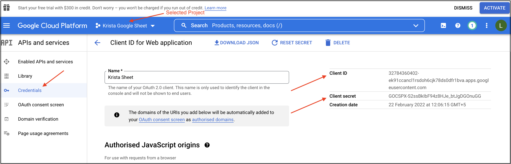
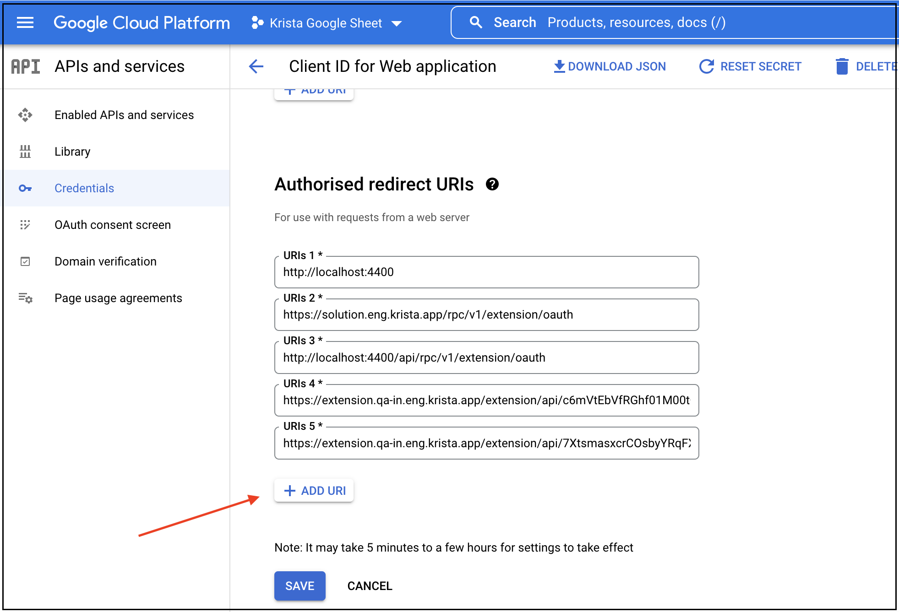

# Connecting Google Services to Krista REST API Extension

## Overview

This guide explains how to configure the Krista REST API Extension to connect with Google services using OAuth 2.0 authentication. You'll need the credentials obtained from your Google Cloud Console project.

## Prerequisites

Before starting, ensure you have:
- Completed the [Google OAuth Setup Guide](pages/gettingClientIDAndClientSecret.md)
- Client ID and Client Secret from your Google Cloud project
- Administrative access to your Krista environment
- The Google account used for project registration

## Configuration Process

### Step 1: Gather Required Credentials

From your Google Cloud Console project, collect the following information:

#### Client ID and Client Secret
Located in the Google Cloud Console under **APIs & Services** > **Credentials**:

### Step 2: Configure Redirect URI in Google Cloud Console

The redirect URI must match exactly between Google Cloud Console and your Krista configuration.

1. **Get Extension Routing ID**:
   - Navigate to your Krista REST API Extension
   - Go to the **Details** tab
   - Copy the **Routing ID** or **Extension Base URL**

2. **Construct Redirect URI**:
   - Take your Extension Base URL or Routing ID
   - Append `/rest/callback` to the end
   - Example: `https://your-krista-domain.com/extensions/rest/callback`

3. **Update Google Cloud Console**:
   - Return to your Google Cloud Console project
   - Navigate to **APIs & Services** > **Credentials**
   - Edit your OAuth 2.0 client
   - Add the complete redirect URI to **Authorized redirect URIs**

### Step 3: Configure Krista REST API Extension

#### OAuth 2.0 Configuration Parameters

In your Krista REST API Extension setup, configure the following OAuth 2.0 parameters:

| Parameter | Value |
|-----------|-------|
| **Auth URL** | `https://accounts.google.com/o/oauth2/v2/auth` |
| **Access Token URL** | `https://oauth2.googleapis.com/token` |
| **Client ID** | Your Google Client ID from Cloud Console |
| **Client Secret** | Your Google Client Secret from Cloud Console |
| **Scope** | Google API permissions (see below for examples) |
| **Auth Verification URL** | `https://www.googleapis.com/drive/v3/about?fields=user` |

**Important Notes:**
- Example Client ID format: `123456789012-abcdefghijklmnop.apps.googleusercontent.com`
- The Auth Verification URL tests the authentication connection
- Choose scopes based on your integration needs (see Common Google API Scopes below)

#### Common Google API Scopes

Choose appropriate scopes based on your integration needs:

**Google Drive Integration**
- `https://www.googleapis.com/auth/drive.readonly`: Read-only access to Drive files
- `https://www.googleapis.com/auth/drive.file`: Access to files created by the app
- `https://www.googleapis.com/auth/drive`: Full access to Drive

**Gmail Integration**
- `https://www.googleapis.com/auth/gmail.readonly`: Read-only access to Gmail
- `https://www.googleapis.com/auth/gmail.send`: Send emails on behalf of user
- `https://www.googleapis.com/auth/gmail.modify`: Read, send, delete, and manage Gmail

**Google Calendar Integration**
- `https://www.googleapis.com/auth/calendar.readonly`: Read-only access to Calendar
- `https://www.googleapis.com/auth/calendar.events`: Manage calendar events

**User Information**
- `https://www.googleapis.com/auth/userinfo.profile`: Basic profile information
- `https://www.googleapis.com/auth/userinfo.email`: User's email address

### Step 4: Validate and Test Connection

#### Initial Authorization Process

1. **Start OAuth Flow**:
   - In the Krista extension setup page, configure your OAuth parameters
   - Save the configuration

2. **Trigger Authentication**:
   - Run a test request through the Krista client
   - An authentication tab will appear
   - Click on the authentication tab to begin OAuth flow

3. **Complete Google Authorization**:
   - You'll be redirected to Google's authorization page
   - Sign in with the same Google account used to register the application
   - Review and grant the requested permissions
   - You'll be redirected back to Krista upon successful authorization

#### Connection Testing

1. **Test Connection**:
   - Return to the extension **Setup** page
   - Click **Test Connection** to verify the integration
   - A successful test confirms that:
     - OAuth flow is working correctly
     - Permissions are properly configured
     - API endpoints are accessible

2. **Verify API Access**:
   - Test actual API calls to ensure data can be retrieved
   - Check that the appropriate scopes are working
   - Confirm error handling is functioning properly

## Authentication Flow

### Initial Setup Flow
1. **Configuration**: Enter OAuth parameters in Krista
2. **Authorization**: User initiates OAuth flow through test request
3. **User Consent**: User grants permissions to your application
4. **Token Exchange**: Authorization code exchanged for access token
5. **Refresh Token**: Long-term token stored for ongoing access

### Ongoing Authentication
1. **Automatic Refresh**: Krista automatically refreshes expired tokens
2. **Seamless Access**: API calls use current valid tokens
3. **Error Handling**: Failed requests trigger token refresh attempts

## Troubleshooting

### Common Configuration Issues

#### Redirect URI Mismatch
- **Symptom**: OAuth flow fails with redirect URI error
- **Solution**: Ensure redirect URI in Google Cloud Console exactly matches Krista configuration
- **Check**: Verify no trailing slashes, protocol mismatches, or extra parameters

#### Invalid Client Credentials
- **Symptom**: Authentication fails during token exchange
- **Solution**: Verify Client ID and Client Secret are correct and haven't been regenerated
- **Check**: Ensure credentials are copied completely without extra spaces

#### Insufficient API Permissions
- **Symptom**: OAuth flow succeeds but API calls fail with permission errors
- **Solution**: Review and update OAuth scopes in Google Cloud Console
- **Check**: Ensure required APIs are enabled in your Google Cloud project

#### API Not Enabled
- **Symptom**: Authentication works but specific API calls fail
- **Solution**: Enable required Google APIs in your Google Cloud project
- **Check**: Verify APIs like Drive API, Gmail API, etc., are enabled

#### Quota Exceeded
- **Symptom**: API calls fail with quota exceeded errors
- **Solution**: Check API quotas in Google Cloud Console
- **Check**: Request quota increases if needed for production use

### Testing Checklist

Before going live, verify:
- [ ] OAuth flow completes successfully
- [ ] Test connection passes
- [ ] Required Google APIs are enabled
- [ ] API calls return expected data
- [ ] Token refresh works automatically
- [ ] Error handling functions properly
- [ ] Appropriate scopes are configured

## Security Considerations

- **Credential Protection**: Store client secrets securely and never expose in logs
- **Permission Scope**: Grant only necessary permissions for your use case
- **Regular Monitoring**: Monitor API usage and access patterns
- **Token Management**: Implement proper token lifecycle management
- **User Consent**: Ensure users understand what permissions they're granting

## Next Steps

With Google services connected, you can:
- [Explore Supported API Requests](pages/supportedRequests.md)
- [Review Authentication Methods](pages/authentication.md)
- Begin integrating Google APIs into your workflows

## Additional Resources

- [Google API Documentation](https://developers.google.com/apis-explorer)
- [Google Cloud Console](https://console.cloud.google.com/)
- [OAuth 2.0 Best Practices](https://developers.google.com/identity/protocols/oauth2/web-server)
- [Google API Client Libraries](https://developers.google.com/api-client-library)
