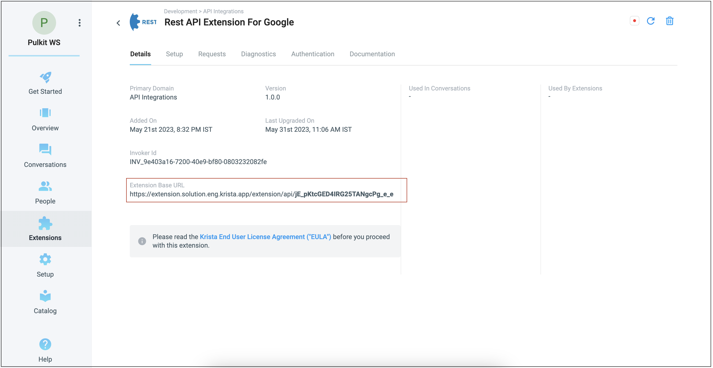
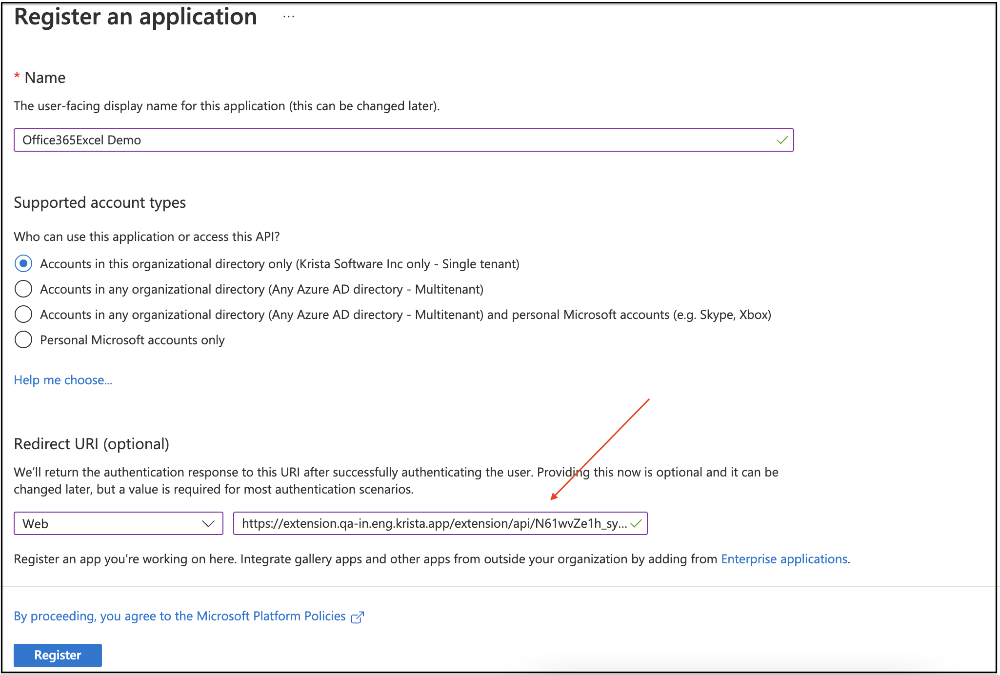

# Connecting Microsoft Services to Krista REST API Extension

## Overview

This guide explains how to configure the Krista REST API Extension to connect with Microsoft services using OAuth 2.0 authentication. You'll need the credentials obtained from your Azure App Registration.

## Prerequisites

Before starting, ensure you have:
- Completed the [Microsoft OAuth Setup Guide](pages/obtainingClientIDClientSecret.md)
- Client ID, Client Secret, and Tenant ID from your Azure App Registration
- Administrative access to your Krista environment
- The email address of the Azure account used for app registration

## Configuration Process

### Step 1: Gather Required Credentials

From your Azure App Registration, collect the following information:

#### Client ID and Tenant ID
Located in the Azure Portal under your app registration's **Overview** section:

#### Client Secret
Located in the **Certificates & secrets** section of your app registration:

### Step 2: Configure Redirect URI in Azure

The redirect URI must match exactly between Azure and your Krista configuration.

1. **Get Extension Base URL**:
   - Navigate to your Krista REST API Extension
   - Go to the **Details** tab
   - Copy the **Extension Base URL**

2. **Construct Redirect URI**:
   - Take your Extension Base URL
   - Append `/rest/callback` to the end
   - Example: `https://your-krista-domain.com/extensions/rest/callback`

3. **Update Azure App Registration**:
   - Return to your Azure App Registration
   - Go to **Authentication** section
   - Add the complete redirect URI to **Redirect URIs**

### Step 3: Configure Krista REST API Extension

#### OAuth 2.0 Configuration Parameters

In your Krista REST API Extension setup, configure the following OAuth 2.0 parameters:

| Parameter | Value |
|-----------|-------|
| **Auth URL** | `https://login.microsoftonline.com/{tenant}/oauth2/v2.0/authorize` |
| **Access Token URL** | `https://login.microsoftonline.com/{tenant}/oauth2/v2.0/token` |
| **Client ID** | Your Application (client) ID from Azure |
| **Client Secret** | Your client secret value from Azure |
| **Scope** | `User.Read Files.Read Mail.Read` (or required permissions) |
| **Auth Verification URL** | `https://graph.microsoft.com/v1.0/me` |

**Important Notes:**
- Replace `{tenant}` in the URLs with your actual Tenant ID
- Example Client ID format: `12345678-1234-1234-1234-123456789012`
- The Auth Verification URL tests the authentication connection

#### Administrator Email Configuration

- **Email Field**: Enter the email address of the Azure administrator account
- **Purpose**: This email is associated with the refresh token for ongoing authentication
- **Requirement**: Must be the same account used to register the application in Azure

### Step 4: Validate and Test Connection

#### Initial Validation
1. In the Krista extension setup page, click **Validate**
2. You'll be redirected to the Microsoft authentication page
3. Sign in with the same administrator account used for Azure app registration
4. Grant the requested permissions to your application

#### Connection Testing
1. After successful validation, return to the **Setup** page
2. Click **Test Connection** to verify the integration
3. A successful test confirms that:
   - OAuth flow is working correctly
   - Permissions are properly configured
   - API endpoints are accessible

## Authentication Flow

### Initial Setup Flow
1. **Configuration**: Enter OAuth parameters in Krista
2. **Validation**: Click Validate to initiate OAuth flow
3. **User Consent**: Administrator grants permissions
4. **Token Exchange**: Authorization code exchanged for access token
5. **Refresh Token**: Long-term token stored for ongoing access

### Ongoing Authentication
1. **Automatic Refresh**: Krista automatically refreshes expired tokens
2. **Seamless Access**: API calls use current valid tokens
3. **Error Handling**: Failed requests trigger token refresh attempts

## Troubleshooting

### Common Configuration Issues

#### Redirect URI Mismatch
- **Symptom**: OAuth flow fails with redirect URI error
- **Solution**: Ensure redirect URI in Azure exactly matches Krista configuration
- **Check**: Verify no trailing slashes or protocol mismatches

#### Invalid Client Credentials
- **Symptom**: Authentication fails during token exchange
- **Solution**: Verify Client ID and Client Secret are correct
- **Check**: Ensure client secret hasn't expired

#### Insufficient Permissions
- **Symptom**: API calls fail with permission errors
- **Solution**: Review and update API permissions in Azure
- **Check**: Ensure admin consent is granted for required permissions

#### Token Refresh Failures
- **Symptom**: Authentication works initially but fails later
- **Solution**: Verify `offline_access` permission is granted
- **Check**: Ensure refresh tokens are being stored properly

### Testing Checklist

Before going live, verify:
- [ ] OAuth flow completes successfully
- [ ] Test connection passes
- [ ] API calls return expected data
- [ ] Token refresh works automatically
- [ ] Error handling functions properly

## Security Considerations

- **Credential Protection**: Store client secrets securely
- **Permission Scope**: Grant only necessary permissions
- **Regular Monitoring**: Monitor API usage and access patterns
- **Token Management**: Implement proper token lifecycle management

## Next Steps

With Microsoft services connected, you can:
- [Explore Supported API Requests](pages/supportedRequests.md)
- [Review Authentication Methods](pages/authentication.md)
- Begin integrating Microsoft Graph APIs into your workflows

## Additional Resources

- [Microsoft Graph API Documentation](https://docs.microsoft.com/graph/)
- [Azure App Registration Guide](https://docs.microsoft.com/azure/active-directory/develop/quickstart-register-app)
- [OAuth 2.0 Best Practices](https://docs.microsoft.com/azure/active-directory/develop/v2-oauth2-auth-code-flow)
