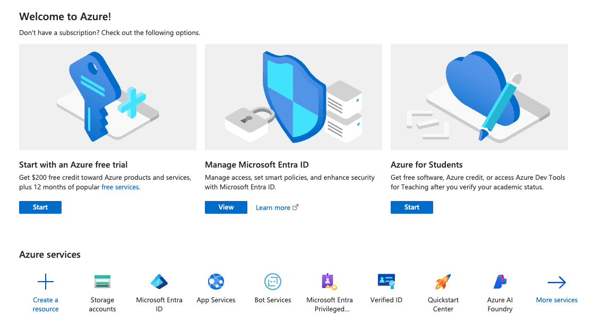
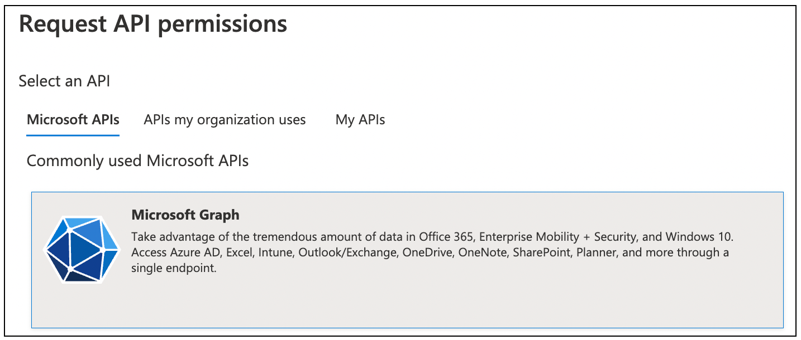
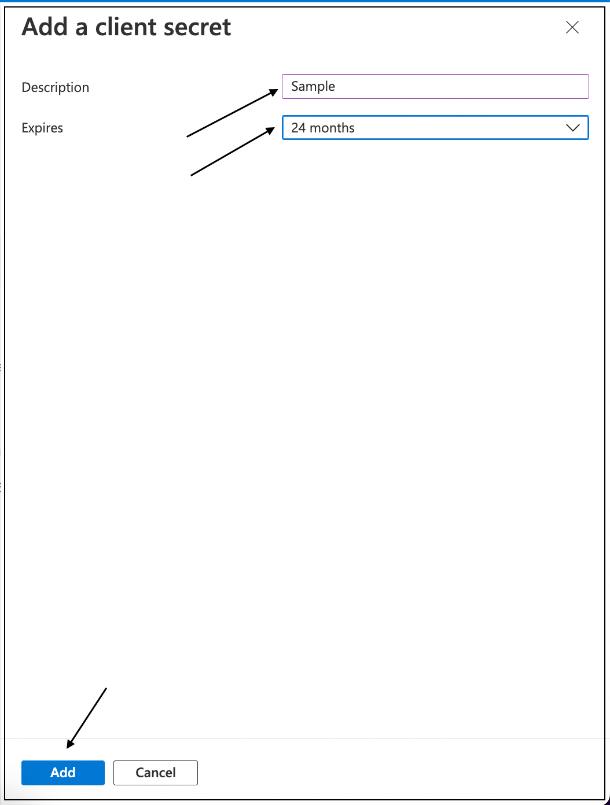

# Microsoft OAuth 2.0 Setup Guide

## Overview

This guide walks you through creating an Azure App Registration to obtain the Client ID, Tenant ID, and Client Secret required for Microsoft OAuth 2.0 integration with the Krista REST API Extension.

## Prerequisites

- Azure subscription with appropriate permissions
- Access to Azure Active Directory (Azure AD)
- Administrative rights to register applications

## Step-by-Step Setup Process

### Step 1: Access Azure Portal

1. Navigate to the [Azure Portal](https://portal.azure.com/)
2. Sign in with your Azure account credentials

### Step 2: Navigate to Azure Active Directory

1. In the Azure Portal home page, locate **Azure services**
2. Click on **Azure Active Directory**
3. If not visible, click **More services** and search for "Azure Active Directory"

### Step 3: Access App Registrations

1. In the Azure Active Directory overview page, locate the **Manage** section in the left navigation
2. Click on **App registrations**

### Step 4: Create New Application Registration

1. Click **+ New registration** at the top of the App registrations page
2. If you have an existing application, you can select it instead

### Step 5: Configure Application Details

Complete the **Register an application** form with the following information:

#### Application Name
- Enter a descriptive name for your application (e.g., "Krista REST API Integration")
- This name will be displayed to users during the consent process

#### Supported Account Types
Select the appropriate option based on your requirements:
- **Single tenant**: Accounts in this organizational directory only (recommended for most cases)
- **Multi-tenant**: Accounts in any organizational directory
- **Personal accounts**: Include personal Microsoft accounts (not recommended for enterprise use)

#### Redirect URI
1. Select **Web** as the platform
2. Enter your Krista REST API Extension redirect URI
3. Format: `https://your-krista-domain/rest/callback`

4. Click **Register** to create the application

### Step 6: Retrieve Client ID and Tenant ID

After successful registration, you'll be redirected to the application overview page.

1. In the **Overview** section, locate the **Essentials** panel
2. Copy and save the following values:
   - **Application (client) ID**: This is your Client ID
   - **Directory (tenant) ID**: This is your Tenant ID

### Step 7: Configure API Permissions

Configure the necessary permissions for Microsoft Graph API access:

1. In the left navigation, click **API permissions**
2. Under **Configured permissions**, click **+ Add a permission**

3. On the **Request API permissions** page, select **Microsoft Graph**

4. Select **Delegated permissions** (for user-context access)

5. Search for and select the following permissions based on your integration needs:

#### Essential Permissions
- **openid**: Required for OpenID Connect authentication
- **offline_access**: Enables refresh token functionality

#### Common Microsoft Graph Permissions
- **User.Read**: Read user profile information
- **Files.Read**: Read user's files in OneDrive
- **Files.ReadWrite**: Read and write user's files
- **Mail.Read**: Read user's email messages
- **Calendars.Read**: Read user's calendar events

6. Click **Add permissions** to apply the selected permissions

> **Note**: Some permissions may require admin consent. Contact your Azure administrator if needed.

### Step 8: Generate Client Secret

Create a client secret for secure authentication:

1. In the left navigation, click **Certificates & secrets**
2. Under **Client secrets**, click **+ New client secret**

3. In the **Add a client secret** panel:
   - **Description**: Enter a meaningful description (e.g., "Krista REST API Secret")
   - **Expires**: Choose an appropriate expiration period (recommended: 12-24 months)
4. Click **Add**

5. **Important**: Copy the client secret **Value** immediately after creation
   - This value will only be displayed once
   - Store it securely for use in your Krista configuration

## Configuration Summary

After completing these steps, you should have the following credentials:

| Credential | Description | Location in Azure Portal |
|------------|-------------|--------------------------|
| **Client ID** | Application identifier | Overview > Application (client) ID |
| **Tenant ID** | Directory identifier | Overview > Directory (tenant) ID |
| **Client Secret** | Application secret | Certificates & secrets > Client secrets |

## Security Best Practices

- **Secure Storage**: Store credentials in a secure location, never in code or logs
- **Regular Rotation**: Plan to rotate client secrets before expiration
- **Minimal Permissions**: Only request permissions your application actually needs
- **Monitor Usage**: Regularly review application usage and permissions

## Next Steps

With your Microsoft OAuth credentials ready, proceed to:
- [Connect Microsoft Services to Krista REST API Extension](pages/connectingMicrosoftWithRestApiExtension_.md)
- [Authentication Configuration Guide](pages/authentication.md)

## Troubleshooting

### Common Issues
- **Permission Denied**: Ensure you have sufficient Azure AD permissions
- **Secret Not Visible**: Client secrets are only shown once during creation
- **Invalid Redirect URI**: Verify the redirect URI matches your Krista configuration exactly

For additional support, consult your Azure administrator or refer to the [Microsoft Azure documentation](https://docs.microsoft.com/azure/).
